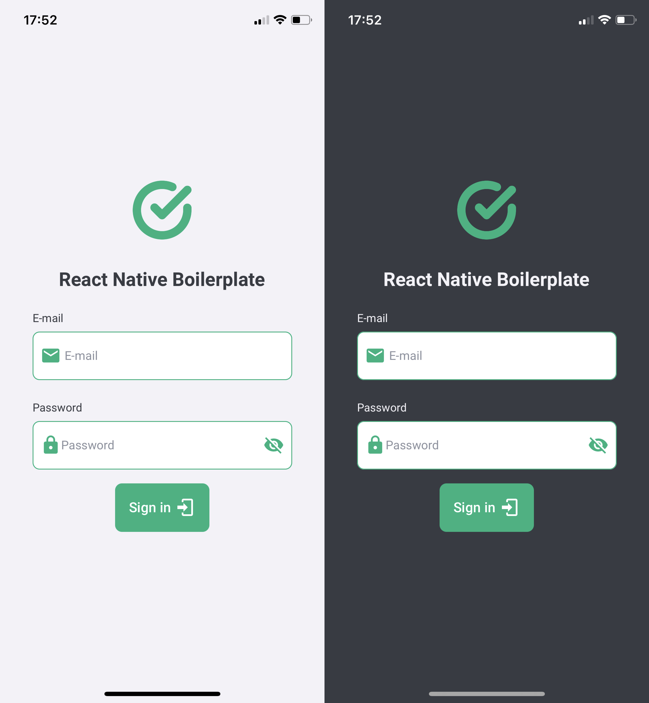

# ⚛️ React Native Boilerplate

This repository contains a personal basic set to init a bare React Native project with Expo and TypeScript.

## ✨ Features

- [x] Custom font ([Roboto](https://fonts.google.com/specimen/Roboto))
- [x] Responsive font size ([react-native-responsive-fontsize](https://www.npmjs.com/package/react-native-responsive-fontsize))
- [x] SVG integration ([react-native-svg-transformer](https://npmjs.com/package/react-native-svg-transformer))
- [x] Routes ([react-navigation](https://reactnavigation.org))
- [x] Path mapping ([babel-plugin-module-resolver](https://www.npmjs.com/package/babel-plugin-module-resolver))
- [x] [styled-components](https://styled-components.com)
- [x] Dark and Light theme
- [x] `Button` and `Input` components
- [ ] Internationalization ([i18n-js](https://www.npmjs.com/package/i18n-js))
